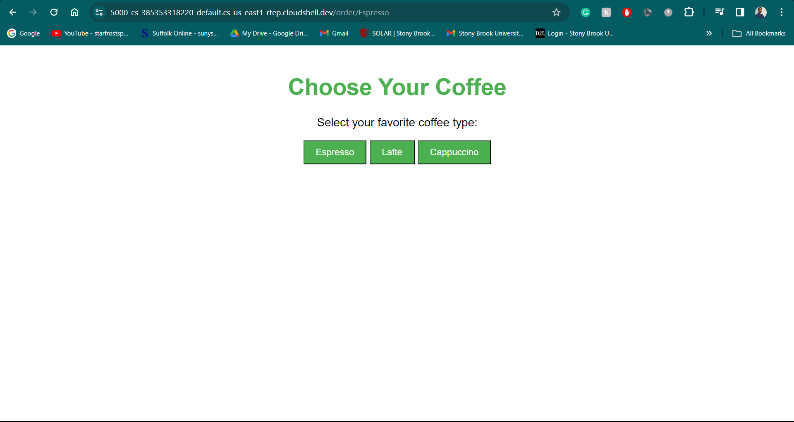

# docker_flask_homework
HHA 504 Assignment 8

## Setup (flask0)
For this assignment I created a basic flask app to run at first to get used to using docker. I included a _requirements.txt_ file to use for later. After that I created a Dockerfile that contained the necessary code to containerize and deploy my flask app. 

I used the following commands in the terminal to set up the docker instance: 

__docker build -t homework .__ 
Was used to create the docker instance

__docker images__
Was used to see what instances were created 

__docker run -p 8005:5000 homework__
Initially, I used this command to tell docker what port to host the app on which was 5000. The 8005 is the port that I will be hosting docker on. Therefore, if I try to access the app through the 5000 port it won't work, only if I switch to 8005 locally.

__docker run -d -p 8005:5000 homework__ 
I later used this command which does the exact same thing as the one above in terms of deploying the app. However, it also will run the docker container in the background. Additionally, it also gives the Container ID.. 

__docker ps__ 
This command will give you a list of all current running containers.

## Setup (flask1 & flask2)

With docker compose you can build and deploy everything that I did before, but using one single line. First I made two new folders called flask1 & flask2. These contained the same exact app that I created in flask0 where I was manually performing the docker commands. I left flask1 as it was, but changed flask2 to a different kind of flask app. I made it to where it was a coffee-focused app where you can order using an order endpoint. This utilized an HTML file to give the app a bit of style.

Once the flask apps were ready I ran them locally using 'python app.py' command to make sure that they were running properly. Then I ran the __docker-compose up --build__ command to deploy both apps simultaneously. 

To stop the apps you just have to do 'ctrl + c' in the terminal and it will gracefully stop the apps. If you want to bring the apps back up you need to type __docker-compose up__. Additionally one of the benefits of using docker-compose compared to regular docker is that I can add changes to my app.py file and it will then update those changes accordingly to the running apps. This is all possible due to the volume section in the _docker-compose.yaml_ file where it can detect changes in the local os and then update those to the virtual os. In regular docker you would have to run a new image in order for the updates to show.

__docker-compose up -d__ Will deploy both of these apps in the background similar to how __docker run -d -p 8005:5000 homework__ does this in regular docker. 

## Issues

In terms of issues I didn't face any when using docker or docker compose. 

